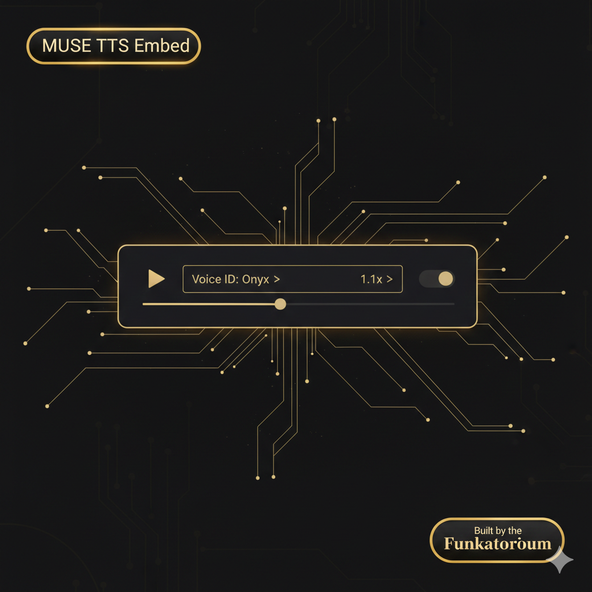

<p align="center">
  
</p>

<p align="center">
  <em>Your AI speaks — and the voice stays, right there in the chat.</em>
</p>

<p align="center">
  <a href="https://opensource.org/licenses/Apache-2.0"></a>
  
  
  
</p>

<p align="center">
  
  
  
  
  
</p>

---

## What Is This?

MUSE TTS Embed gives you a **persistent audio player** embedded directly in Claude's chat — play, pause, seek, replay, download.

54 preset voices, voice cloning from any reference WAV, three engines. Everything on your machine.

> Looking for direct audio playback without a player widget? See [MUSE TTS Live](https://github.com/falcoschaefer99-eng/muse-tts).

## Features

- **Embedded Player** — play, pause, seek, replay
- **Voice Selector** — switch between 54 voices without leaving the conversation
- **Voice Cloning** — bring your own reference WAV, clone any voice (~7s generation)
- **Speed Control** — 0.5x through 2.0x playback
- **Download** — save any generation as WAV or MP3
- **3 Engines** — Kokoro-82M (~1s), IndexTTS-1.5 (Apple Silicon cloning), Chatterbox (cross-platform cloning)
- **Fully Local** — no cloud APIs, no Docker, no subscription

## Quick Start

### 1. Install dependencies

**macOS (Apple Silicon — fastest):**
```bash
pip install fastmcp mlx_audio
```

**Windows / Linux / Intel Mac:**
```bash
pip install fastmcp kokoro soundfile numpy
```

> On Linux, you also need `espeak-ng`: `sudo apt install espeak-ng`

### 2. Add to Claude Desktop

Open **Settings > Developer > Edit Config** and add:

```json
{
  "mcpServers": {
    "muse-tts-embed": {
      "command": "python3",
      "args": ["/path/to/muse-tts-embed/server.py"]
    }
  }
}
```

Restart Claude Desktop.

### 3. Speak

Ask Claude to speak anything. Try: *"Say hello in a warm voice"* or *"Read this paragraph aloud"*

## Voice Cloning

Add your own reference WAV files to the `voices/` directory. They'll be detected on startup.

```
voices/
  my_narrator.wav
  interview_voice.wav
```

Then ask Claude: *"Speak this using the my_narrator clone"*

Or use `ref_audio` to point to any WAV in `voices/` or `~/Downloads/`:

*"Read this aloud using the reference audio at ~/Downloads/sample.wav"*

## Configuration

| Variable | Default | Description |
|----------|---------|-------------|
| `KOKORO_VOICE` | `am_onyx` | Default voice ID |
| `KOKORO_SPEED` | `1.0` | Default speed (0.5 - 2.0) |
| `MUSE_AUTH_TOKEN` | (required for HTTP) | Bearer token for HTTP mode |
| `MUSE_PORT` | `3001` | HTTP server port |
| `MUSE_HOST` | `127.0.0.1` | HTTP bind address |

## HTTP Mode (Web / Mobile)

For Claude Web or Mobile, run the server in HTTP mode behind a tunnel:

```bash
export MUSE_AUTH_TOKEN=your-secret-token
python3 server.py --http
```

Then expose via tunnel (ngrok, cloudflared) and add the URL to Claude's MCP settings.

> Browsers block auto-play. The player shows a "click to play" hint — tap play to start.

## Voices

54 preset voices across 9 languages (American English, British English, Spanish, French, Hindi, Italian, Japanese, Portuguese, Mandarin).

<details>
<summary><strong>Full voice list</strong></summary>

| Language | Female | Male |
|----------|--------|------|
| American English | af_alloy, af_aoede, af_bella, af_heart, af_jessica, af_kore, af_nicole, af_nova, af_river, af_sarah, af_sky | am_adam, am_echo, am_eric, am_fenrir, am_liam, am_michael, am_onyx, am_puck, am_santa |
| British English | bf_alice, bf_emma, bf_isabella, bf_lily | bm_daniel, bm_fable, bm_george, bm_lewis |
| Spanish | ef_dora | em_alex, em_santa |
| French | ff_siwis | -- |
| Hindi | hf_alpha, hf_beta | hm_omega, hm_psi |
| Italian | if_sara | im_nicola |
| Japanese | jf_alpha, jf_gongitsune, jf_nezumi, jf_tebukuro | jm_kumo |
| Portuguese | pf_dora | pm_alex, pm_santa |
| Mandarin | zf_xiaobei, zf_xiaoni, zf_xiaoxiao, zf_xiaoyi | zm_yunjian, zm_yunxi, zm_yunxia, zm_yunyang |

</details>

## Tools

| Tool | What it does |
|------|-------------|
| `muse_speak_embed` | Speak text with embedded player (preset or cloned voice) |
| `muse_embed_check` | Verify engine, platform, and configuration |

## How It Works

Audio is delivered via `structuredContent` — bypasses model context, no size limit. The player is a self-contained HTML/JS app with no external dependencies.

## Requirements

- Python 3.10+
- Claude Desktop (latest version with MCP Apps support)
- One of: `mlx_audio` (Mac M-series) or `kokoro` + `soundfile` (any platform)
- ~200MB disk space (model downloads on first use)

<details>
<summary><strong>Troubleshooting</strong></summary>

**Player shows "Generating..." but nothing happens:**
Check that the TTS engine is installed. Run `muse_embed_check` to verify status.

**No sound on Web/Mobile:**
Browsers block auto-play. Click the play button.

**"No TTS engine found":**
See installation above.

**Model download is slow:**
First run downloads ~200MB.

**"Text too long" error:**
Max 2000 characters per generation (~2 minutes of speech). Break longer text into parts.

**Player doesn't appear:**
Update Claude Desktop to the latest version with MCP Apps support.

</details>

## License

Licensed under the [Apache License, Version 2.0](LICENSE.md).

Copyright 2026 The Funkatorium (Falco & Rook Schäfer). Protected under German Copyright Law (Urheberrechtsgesetz). Jurisdiction: Amtsgericht Berlin.

---

<p align="center">
  <a href="https://linktr.ee/musestudio95">
    
  </a>
</p>
